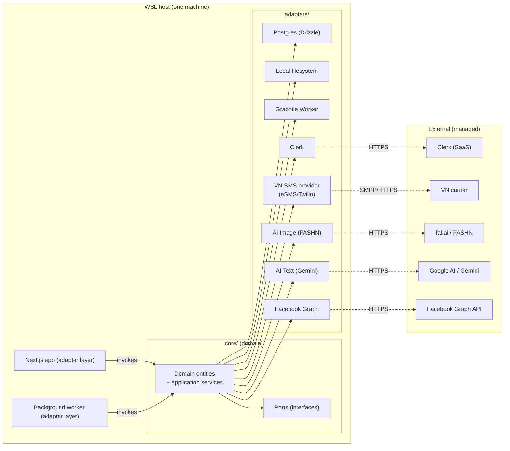
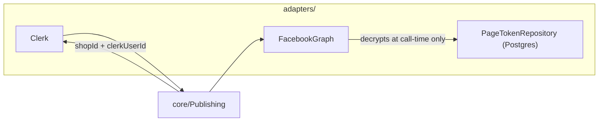
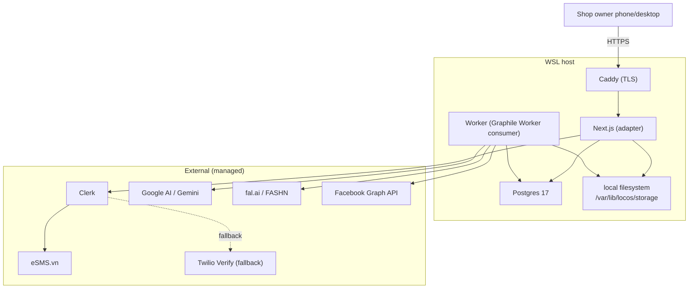

# Architecture Spine — locos

## Design Paradigm

**Hexagonal (ports-and-adapters).** The `core/` holds application services and domain entities. It depends on **ports** — interface-only contracts — and on **no** external SDK, ORM, or HTTP framework. Adapters in `adapters/` implement the ports and own all contact with concrete things: Postgres, the local filesystem, Graphile Worker (background job queue), Clerk (auth), eSMS.vn / Twilio Verify (SMS providers), fal.ai + FASHN (image generation), Google AI Studio + Gemini (text generation), Facebook Graph API v25.0. The Next.js app and the background worker are themselves adapters at the boundary — they call into `core/`, not into other adapters directly.

Why this and not layered: AI providers, SMS providers, and the auth vendor are the parts most likely to be swapped, A/B'd, or mocked. The architecture's durability lives in keeping their volatility out of the domain.

The smallest durable thing here: **the core/application boundary**.



## Inherited Invariants

No parent spine. The PRD binds here as the upstream requirement contract; UX binds as the upstream experience contract; binding IDs are listed in the frontmatter.

## Invariants & Rules

### AD-1 — Hexagonal core. Adapters implement ports; core depends on no SDK.

- **Binds:** all PRD FRs, all NFRs, all UX surfaces.
- **Prevents:** vendor lock-in leaking into domain logic; the same core being untestable without the network; divergent per-adapter retry/auth/timeout semantics.
- **Rule:** every concrete call to Postgres, the filesystem, the job queue, Clerk, the SMS provider, FASHN, Gemini, or Facebook Graph lives in `adapters/<name>/`. The `core/` package imports only from `ports/`. No reverse dependency.

### AD-2 — AI generation is always async. No HTTP request waits on FASHN or Gemini.

- **Binds:** NFR4 (tens-of-seconds latency target), UX Flow 1 generation wait, FR9/FR10/FR12.
- **Prevents:** thundering herds tying up Next.js request handlers; lost work when a user closes the tab; serverside timeouts corrupting partial state.
- **Rule:** FASHN and Gemini calls run inside Graphile Worker jobs in `jobs/`. The HTTP request creates the job, returns `{jobId}` immediately (≤ 2s client-perceived), and the UI polls job status (≤ 3s interval). No long-poll, no SSE-via-Next — keeps the worker stack boring.

### AD-3 — FB post is owner-content. We never edit, never delete; we only ever create new.

- **Binds:** PRD FR16, FR17, FR18, FR19; UX voice rule "FB post is the shop's content."
- **Prevents:** internal tools mutating FB posts that a shopper may already be viewing; silent corruption when locos and FB diverge; "the shop owns the customer" being violated.
- **Rule:** `core/Publishing` exposes exactly one outward action: `createPost(productId, currentRevisionId)`. There is no `updateFbPost`, `deleteFbPost`, or `editFbPost` function anywhere — not in core, not in adapters, not in jobs. Republish = create-post-again with the current revision. **Post body composition** is limited to the shop's images, caption, and contact info — no locos URL, watermark, or CTA in Phase 1 (per Design Do "the FB post is the shop's content").

### AD-4 — Originals are immutable and content-addressable. Every image is named by the bytes that produced it.

- **Binds:** PRD NFR8 (data handling), FR12 (regeneration), UX Flow 1 per-image regen.
- **Prevents:** lost regeneration history; "this product's image is now bytes 0xABC" race conditions between regen and delete; silent drift when a regen re-rolls an image whose bytes already exist for another product.
- **Rule:** the storage adapter namespaces objects by **shop id** (separating shops' bytes) AND names each object by **sha256 of the bytes** (separation within a shop, plus immutability). The shape is `originals/{shopId}/{sha256}.{ext}` and `generated/{shopId}/{sha256}.{ext}`. Two shops' byte-identical uploads never share storage. Re-generating an image never mutates the row; it inserts a new immutable row pointing to new bytes. **Owner-initiated deletion of a generated image is tombstone-on-row** — the row is marked deleted but the bytes persist for the retention window; offboarding the only remaining reference is what frees storage.

### AD-5 — Multi-tenant from day one. Every query carries `shopId`.

- **Binds:** all FRs (the shop is the unit of all data), NFR5 (token scope).
- **Prevents:** the cross-shop read that lands in a security incident; ambiguous ownership when the parent business starts provisioning accounts faster than originally planned.
- **Rule:** every `core/` data access goes through repositories whose method signatures take `shopId` as a required argument. There is no "load by primary key" at the core — only "load this shop's X." Adapter-level Postgres queries include `WHERE shop_id = $1` as a non-optional parameter. Defense in depth.

### AD-6 — Generation job idempotency. Same `(shopId, productId, inputFingerprint)` → same output, never double-billed.

- **Binds:** NFR7 (cost observability), FR12 (regen semantics).
- **Prevents:** accidentally paying FASHN twice when a user clicks "Regenerate" twice; two parallel regens corrupting a product's image set.
- **Rule:** every `jobs/RegenerateImageJob` carries a `jobKey = hash(shopId, productId, imageIndex, inputFingerprint)`. Graphile Worker enforces single-instance-on-key via its `job_key` column. Two requests for the same key resolve to the same job, not two concurrent calls.

### AD-7 — Auth boundary: Clerk owns identity; locos stores only `clerk_user_id`.

- **Binds:** PRD FR1, FR2, FR3, FR4.
- **Prevents:** locos shipping a phone-number-OTP flow that we have to maintain, audit, and harden; phone numbers in our DB adding GDPR/PDPA scope we don't yet own.
- **Rule:** the `ports/Auth` interface exposes `getCurrentShop()`, `requestOtp(phone)`, `verifyOtp(phone, code)`, `getFacebookPageToken(shopId, pageId)`. The `adapters/Clerk` adapter implements all of them via Clerk. Locos's `shop` row stores `clerk_user_id` and **never** the phone number, the OTP code, or the OTP TTL. Phone numbers and OTPs flow through Clerk's vendor.

### AD-8 — FB Page access tokens are encrypted-at-rest and revocable.

- **Binds:** PRD NFR5 (security), NFR8 (data handling), FR7 (token expiry).
- **Prevents:** a database leak yielding usable FB tokens; an owner disconnecting a Page from leaving a token row that still works.
- **Rule:** the `ports/PageTokenRepository` interface: `store(shopId, pageId, token, scope, expiresAt)`, `revoke(shopId, pageId)`, and a **callback-shaped** decryptor `withDecryptedToken(shopId, pageId, fn)` — the caller passes a closure, the decrypted token is materialized only inside `fn`, and the closure's return value is returned without the token reference ever being exposed to the caller. The Postgres adapter stores tokens encrypted with an envelope key derived from a host secret (libsodium secretbox with a key from a single env var). Decryption happens at the moment of an API call, only inside the `adapters/FacebookGraph` boundary; no caller anywhere ever holds the decrypted token reference.



### AD-9 — Cross-unit writes are atomic; per-product mutation is serialized.

- **Binds:** PRD FR12, FR16, FR17 (regen-vs-republish-race), NFR6 (resilience), PRD §3 CM3 surface.
- **Prevents:** the Next.js handler committing a partial write that a running Graphile Worker job read on its start; two rebuild flows on the same product row interleaving; a successful FB post whose locator is then lost because the job crashed between API call and DB write.
- **Rule:** every multi-row write visible to another unit (Next.js ↔ worker) executes inside a single Drizzle transaction that commits atomically; job handlers **re-read state at job start** and re-check ownership before mutating; regeneration and republish on the same product serialize at the row level via `SELECT … FOR UPDATE` (or equivalent Graphile Worker job-key uniqueness — see AD-6). Transient failures from third parties (FASHN, Gemini, Facebook Graph) emit a structured **retry surface** (logged event + UI affordance from `EXPERIENCE.md` Flow 1 failures); `publish_succeeded` is logged **only after the FB API confirmed success AND the locator was persisted in the same transaction**.

### AD-10 — Worker-job boundary is explicit. Every job re-verifies the shop.

- **Binds:** PRD FR4 (only provisioned accounts authenticate), NFR5 (security).
- **Prevents:** a forgotten or bypassed auth check at the worker boundary; a deactivated or offboarded shop's queued job running unattended; a job-key collision allowing one shop's job to be processed under another shop's identity.
- **Rule:** the **first statement of every Graphile Worker job handler** is `verifyShopActive(shopId)` via the Clerk adapter; the handler exits cleanly with `JobError('shop_inactive')` otherwise. Job arguments are validated against a per-job schema (Zod) before any other call. No background work runs without an active, provisioned shop.

### AD-11 — FB publish has a small state machine; reconciliation is deferred.

- **Binds:** PRD FR16, FR20, FR21; PRD §3 CM3.
- **Prevents:** silent FB-post "success" with no committed row; an FB post that's lost when the DB write crashes; a stuck publish that neither completes nor surfaces to the owner.
- **Rule:** every publish job writes a `publish_attempt` row in `state='pending'` **before** the FB API call, transitions to `state='succeeded'` with the post id stored in the same transaction as the API success response, or `state='failed'` with the error envelope on transient / permanent classification. A queued-but-not-yet-attempted publish is `state='queued'`; a publish where the API call neither succeeded nor definitively failed is `state='unknown'` and visible to ops as needing reconciliation (reconciliation strategy itself is **deferred** — see below).

## Consistency Conventions

| Concern | Convention |
|---|---|
| Identifier type | `cuid2` everywhere for locos-issued ids (shop, product, image, job). Clerk user id and FB page id stored as opaque strings. |
| Time | Postgres stores UTC `timestamp`. API payloads ISO 8601 with `Z`. UI renders via `Intl.DateTimeFormat('vi-VN', …)` against the shop's locale. |
| Money | VND stored as integer (smallest unit). Never float. UI format: `Intl.NumberFormat('vi-VN', { style: 'currency', currency: 'VND', maximumFractionDigits: 0 })`. |
| Naming | DB columns `snake_case`; TS identifiers `camelCase`; URLs `kebab-case`; TypeScript types mirror Postgres types 1:1 (Drizzle infers both). |
| Errors | Core defines `DomainError` (sealed). Each adapter maps SDK errors to a `DomainError` subtype at the adapter boundary (`AuthError`, `AIGenerationError`, `FacebookGraphError`, `StorageError`, `JobError`). |
| Logging | Structured JSON: `{ timestamp, level, trace_id, shop_id, job_id, event, … }`. Never log PII: phone numbers, OTP codes, FB tokens, image bytes, generated image URLs (signed-URL fragments logged instead, never the full token). |
| Configuration | All environment-specific values via `env.ts` with Zod schema validation at boot. No `process.env.X` reads outside `env.ts`. |
| Authentication on internal calls | Next.js routes check `getCurrentShop()` via Clerk middleware; background worker jobs receive `shopId` as a job argument and re-check via the auth adapter (no silent bypass for scheduled jobs). |
| Image storage paths | `originals/{shopId}/{sha256}.{ext}` and `generated/{shopId}/{sha256}.{ext}` — shop-namespaced, content-addressable. No directory layout dependent on time. |
| Counter-metric + success-metric event emission | Every write path logs the events that feed PRD §3 metrics: `shop_login`, `product_created`, `generation_started`, `generation_completed`, `generation_failed`, `regeneration_requested`, `publish_attempted`, `publish_succeeded`, `publish_failed`, `reconnect_required`, `product_sold_out_toggled`. Same `DomainError` logger; never log PII or token bytes. |
| Account provisioning | **Operator-only.** No self-service signup path exists in application code. A shop row is created only by a locos-team internal tool that takes `clerk_user_id` from an out-of-band provisioning script. Application code never accepts phone numbers or personal data from a public surface for the purpose of account creation. |

## Stack

| Name | Version |
|---|---|
| Node.js | 24 LTS (Active LTS) |
| Next.js | 15.x (App Router; check whether Next.js 16 has shipped before locking) |
| TypeScript | 5.x |
| Postgres | 17 (Postgres 18 is current; 17 is the conservative choice) |
| ORM | Drizzle (v0.44 stable / v1.0-beta acceptable) |
| Job queue | **Graphile Worker** (Postgres-native queue with single-instance-on-key via `job_key`; chosen over the deprecated pg-boss, whose README now redirects here) |
| Auth (vendor) | Clerk (Next.js SDK) |
| SMS provider (vendor) | eSMS.vn (primary, direct VN carrier routes) — Twilio Verify (fallback, behind the same Clerk SMS-provider-config) |
| AI text | Google AI Studio — **Gemini 3 Pro** |
| AI image | fal.ai — FASHN v1.6 (`/fashn/tryon/v1.5-or-later`); benchmark against IDM-VTON / Leffa before locking final model |
| Facebook Graph API | v25.0 (verify against the 2026-01-12 Meta blog post on `pages_manage_posts` before shipping publish path) |
| File storage | local filesystem on the same WSL host (`/var/lib/locos/storage/`); served via Next.js route with auth-checked signed-URL handoff for generated assets |
| Logging / observability | pino (structured JSON) → stdout; inexpensive single-host scrape to a local file; no managed APM in Phase 1 |
| Deployment | systemd unit on the WSL host; `next start` for the web; a separate systemd unit for the `worker` process |
| TLS | Caddy in front of Next.js for HTTPS termination (single cert via Let's Encrypt DNS-01 if exposed; otherwise LAN-only) |

## Structural Seed

```text
locos/
  app/                        # Next.js routes (adapter layer at the boundary)
    (auth)/                   # clerk login surface
    (shop)/
      catalog/page.tsx
      products/
        new/page.tsx
        [id]/page.tsx
    api/
      products/route.ts        # create product (returns {productId, jobId})
      products/[id]/fb-post/route.ts   # republish action
      jobs/[jobId]/route.ts    # poll job status
  core/                       # application services + domain (no SDK imports)
    shop/                     # Shop aggregate, provisioning rules
    product/                  # Product aggregate, generation flow, sold-out toggle
    publishing/               # createPost(productId, revisionId) — see AD-3
    catalog/                  # Listing + sold-out filters
    errors.ts                 # DomainError sealed class hierarchy
  ports/                      # interfaces only
    auth.ts
    storage.ts
    job-queue.ts
    ai-image.ts
    ai-text.ts
    sms.ts                    # only used by Clerk's SMS config; not invoked by core
    page-token-repository.ts
    publishing.ts             # createPost contract surface
  adapters/
    postgres/
      schema.ts               # Drizzle schema (one file per aggregate)
      migrations/
      repositories/           # implements ports for persistence
    filesystem/
      image-store.ts          # implements ports/storage; content-addressable
    graphile-worker/
      index.ts                # implements ports/job-queue + workers
      jobs/
        generate-product.ts   # orchestrator: text → image → persist
        regenerate-image.ts
        fb-publish.ts
    clerk/
      auth.ts                 # implements ports/auth
      sms-config.ts           # eSMS.vn / Twilio Verify wiring (provider-side)
    gemini/
      text-generator.ts
    fashn/
      image-generator.ts
    facebook/
      graph-client.ts         # implements ports/publishing; decrypts token per call (AD-8)
  jobs/                       # worker entrypoint; reads adapters/* and core/*
    worker.ts                 # boots Graphile Worker, wires handlers
  db/                         # one-shot scripts (migrate, seed dev shop)
    migrate.ts
  env.ts                      # Zod-validated env loader; the only file reading process.env
```



## Capability → Architecture Map

| Capability / Area | Lives in | Governed by |
|---|---|---|
| Phone-OTP login (FR2) | `app/(auth)/*` → `adapters/clerk/auth.ts` → Clerk | AD-1, AD-7 |
| Shop provisioning (FR1, FR4) | `core/shop/`, `adapters/postgres/repositories/shop-repository.ts` | AD-1, AD-5 |
| FB Page connection (FR5/FR6/FR7) | `app/(shop)/connect-fb/*` → `adapters/clerk/auth.ts.getFacebookPageToken` | AD-1, AD-7, AD-8 |
| New product + generation (FR8–FR14) | `app/(shop)/products/new/page.tsx` → `core/product/create-generation-job.ts` → `jobs/generate-product.ts` → `adapters/gemini` + `adapters/fashn` + `adapters/filesystem` + `adapters/postgres` | AD-1, AD-2, AD-4, AD-5, AD-6 |
| Image regeneration per-image (FR12 + UX Flow 1) | `core/product/regenerate-image.ts` → `jobs/regenerate-image.ts` | AD-2, AD-4, AD-6 |
| Edit title/description/price (FR13) | `core/product/edit-revision.ts` → `adapters/postgres` | AD-1, AD-5 |
| Catalog list/edit/delete/sold-out (FR22–FR25) | `app/(shop)/catalog/page.tsx` → `core/catalog/*` → `adapters/postgres` | AD-1, AD-5 |
| FB publish / republish (FR15–FR21) | `core/publishing/create-post.ts` → `jobs/fb-publish.ts` → `adapters/facebook` | AD-1, AD-3, AD-5, AD-8 |
| Token expiry handling (FR7) | `adapters/clerk/auth.ts.getFacebookPageToken` resolves to Clerk's stored state; UI in `EXPERIENCE.md` Flow 3 prompts reconnect | AD-7, AD-8 |
| Data retention / offboarding (NFR8) | `core/shop/offboarding.ts` (tombstone rows); deletes gated by adapter-level soft-delete; tokens revoked via `ports/PageTokenRepository.revoke` | AD-4, AD-8 |
| Cost observability (NFR7) | `adapters/gemini` + `adapters/fashn` log per-call cost + tokens to structured log; `db/aggregate-cost.sql` reads it back | NFR7 (convention) |

## Deferred

- **Search / discovery / Phase 2 features.** Out of scope; not in the spine.
- **FB image watermarking + discovery link (Phase 2).** Out of scope; not in the spine.
- **Migration to managed queue (Inngest / Trigger.dev).** Graphile Worker is sized for Phase 1; revisit if job throughput breaks the single-worker-per-host model.
- **Image CDN at the edge.** Worth it only past Phase 2 scale; local filesystem + signed URL is correct for now.
- **Multi-region / HA.** Single-WSL-host is the Phase 1 deployment target. HA is a Phase-3 conversation.
- **Self-hosted auth.** Clerk is currently the third-party boundary; the architecture is **not** locked out of swapping in a self-hosted alternative later (AD-1 + AD-7 keep that option open) — but doing so costs the "don't manage auth yourself" benefit.
- **OQ4 admin view.** Whether internal team metrics live in this app or external internal tooling — out of scope here; deferred.
- **A/B harness for AI text model (Gemini vs GPT-5.5).** Tiny adapter interface allows it but not built.
- **Sleeve / draping quality regressions** beyond FR10's soft target. Counter-metric CM1/CM2 (PRD §3) is what we watch; no quality gate below that for now.
- **FB publish reconciliation strategy.** AD-11 surfaces `state='unknown'` rows to ops; the actual reconciliation play (query FB Graph to confirm or refute post existence, then close out the row) is not in the spine. Phase 1 ships with "ops-visible stuck rows + manual intervention"; revisit when stuck-row volume justifies automation.

## Open Questions (carried)

- **OQ1 (PRD):** regen cap. No cap in code; revisit when per-shop generation cost is observable.
- **OQ3 (PRD):** FB token-expiry handling specifics — who else is notified on expiry, what's the recover path when reconnect fails. Owned by the system architect once a UX flow for reconnect has been in owners' hands for a sprint.
- **Meta 2026-01-12 blog post on `pages_manage_posts`.** Single highest-risk unknown for the publish path; verify before `jobs/fb-publish.ts` ships.

## Verification status

All non-trivial stack choices in this spine were web-researched against mid-2026 sources during this run; see the memlog. Items flagged "unverified" in research notes:

- The 2026-01-12 Meta blog post body on `pages_manage_posts` could not be retrieved.
- FASHN v1.6 end-to-end latency in seconds was reported by third-party blogs only; verify in a pre-launch spike.

Both are tracked in the Open Questions section above.
